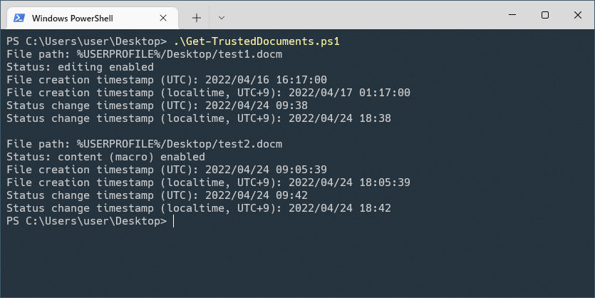

# PS-TrustedDocuments: Microsoft Office の信頼済みドキュメントの情報を扱う PowerShell スクリプト

[English](README.md) | Japanese



[信頼済みドキュメント](https://support.microsoft.com/ja-jp/office/%E4%BF%A1%E9%A0%BC%E6%B8%88%E3%81%BF%E3%83%89%E3%82%AD%E3%83%A5%E3%83%A1%E3%83%B3%E3%83%88-cf872bd8-47ec-4c02-baa5-1fdba1a11b53)はアクティブコンテンツ(マクロ等)を有効にすることで信頼済みとマークされた Microsoft Office 文書ファイルです。Microsoft Office 文書ファイルは以下のメッセージバーの「編集を有効にする」又は「コンテンツの有効化」をクリックした際に信頼済みとマークされます。


信頼済みドキュメントの情報は Windows のレジストリに保存されており以下のプロパティがあります:
- ファイルパス
- 状態(編集が有効又はコンテンツ(マクロ)が有効)
- ファイル作成日時
- 状態変更日時(最後に編集又はマクロを実行した日時)
- タイムゾーンのオフセット

信頼済みドキュメントの情報はいつどの悪意のある Microsoft Office 文書ファイルのマクロが実行されたか調べることでインシデントレスポンスに役立ちます。そのため私は Get-TrustedDocuments.ps1 という信頼済みドキュメントの情報を表示する PowerShell スクリプトを作りました。信頼済みドキュメントの情報を変更したり削除したりする PowerShell スクリプトも将来作成する予定です。

<!-- [Get-TrustedDocuments.ps1](https://github.com/nmantani/PS-TrustedDocuments#get-trusteddocumentsps1) -->

このスクリプトの使い方は以下で説明しています。`Get-Help` コマンドレットでも同じ情報を見ることができます。

## Get-TrustedDocuments.ps1
このスクリプトは `HKEY_CURRENT_USER\SOFTWARE\Microsoft\Office\[バージョン]\[文書の種類]\Security\Trusted Documents` 以下のレジストリキーから信頼済みドキュメントの情報を取得します。このスクリプトは信頼済みドキュメントの状態(編集が有効又はコンテンツ(マクロ)が有効)、ファイル作成日時と状態変更日時(最後に編集又はマクロを実行した日時、時刻は分単位)を表示します。

### 使い方
```powershell
PS> powershell -ExecutionPolicy Bypass .\Get-TrustedDocuments.ps1
[[-DocumentType] <String>] [-EditingEnabledOnly] [-ContentEnabledOnly]
[[-User] <String>] [[-HiveFilePath] <String>] [<CommonParameters>]
```

### パラメータ (全て任意)
- DocumentType  
Word、Excel、PowerPoint 等の文書の種類を指定します。指定された種類のファイルの情報のみを表示します。このパラメータは大文字と小文字が区別されません。

- EditingEnabledOnly  
このパラメータが指定されると編集が有効なファイルの情報のみを表示します。

- ContentEnabledOnly  
このパラメータが指定されるとコンテンツ(マクロ)が有効なファイルの情報のみを表示します。

- User  
ユーザを指定します。もしこのパラメータも `HiveFilePath` のパラメータも指定されていない場合は現在のユーザの情報を表示します。このパラメータを使って他のユーザの情報を表示する場合は Administrator の権限が必要です。

- HiveFilePath  
オフラインレジストリハイブファイル(別のコンピュータから取得した `NTUSER.DAT` ファイル)のパスを指定します。もしこのパラメータも `User` のパラメータも指定されていない場合は現在のユーザの `HKEY_CURRENT_USER` のレジストリハイブを使用します。このパラメータを使用するとオフラインレジストリハイブファイルを一時的に `HKEY_USERS\PS-TrustedDocuments` レジストリキーに読み込むため Administrator の権限が必要です。

### 使用例
```powershell
# 現在のユーザの全ての信頼済みドキュメントの情報を表示します。

PS> powershell -ExecutionPolicy Bypass .\Get-TrustedDocuments.ps1
```

```powershell
# 現在のユーザの信頼済みの Word 文書ファイルの情報を表示します。

PS> powershell -ExecutionPolicy Bypass .\Get-TrustedDocuments.ps1 -DocumentType word
```

```powershell
# 編集が有効な信頼済みドキュメントの情報を表示します。

PS> powershell -ExecutionPolicy Bypass .\Get-TrustedDocuments.ps1 -EditingEnabledOnly
```

```powershell
# コンテンツ(マクロ)が有効な信頼済みドキュメントの情報を表示します。

PS> powershell -ExecutionPolicy Bypass .\Get-TrustedDocuments.ps1 -ContentEnabledOnly
```

```powershell
# 指定したユーザの信頼済みドキュメントの情報を表示します。
# 別のユーザの情報を表示するには Administrator の権限が必要です。

PS> powershell -ExecutionPolicy Bypass .\Get-TrustedDocuments.ps1 -User exampleuser
```

```powershell
# オフラインレジストリハイブファイルから信頼済みドキュメントの情報を表示します。
# Administrator の権限が必要です。

PS> powershell -ExecutionPolicy Bypass .\Get-TrustedDocuments.ps1 -HiveFilePath .\extracted\NTUSER.DAT
```

## 謝辞
Malwrologist ([@DissectMalware](https://twitter.com/DissectMalware)) さんの [OfficeForensicTools](https://github.com/DissectMalware/OfficeForensicTools) のコードや[ツイート](https://twitter.com/DissectMalware/status/1242399401156452353)から信頼済みドキュメントの非公開のデータ構造やタイムスタンプの計算方法についての重要な知見を得ることができました。ありがとうございます!

## 参考資料
- [信頼済みドキュメント](https://support.microsoft.com/ja-jp/office/%E4%BF%A1%E9%A0%BC%E6%B8%88%E3%81%BF%E3%83%89%E3%82%AD%E3%83%A5%E3%83%A1%E3%83%B3%E3%83%88-cf872bd8-47ec-4c02-baa5-1fdba1a11b53) (Microsoft)
- [OfficeForensicTools](https://github.com/DissectMalware/OfficeForensicTools) by Malwrologist ([@DissectMalware](https://twitter.com/DissectMalware))
- [A Twitter thread explaining undocumented data structure and timestamp calculation of trusted documents](https://twitter.com/DissectMalware/status/1242399401156452353) by Malwrologist ([@DissectMalware](https://twitter.com/DissectMalware))
- [More on Trust Records, Macros and Security, Oh My!](http://az4n6.blogspot.com/2016/02/more-on-trust-records-macros-and.html) by Mari DeGrazia ([@maridegrazia](https://twitter.com/maridegrazia))
- [MS Office File Format Sorcery](https://troopers.de/downloads/troopers19/TROOPERS19_AR_MS_Office_file_format_sorcery.pdf) by Pieter Ceelen & Stan Hegt

## 作者
萬谷 暢崇 (Twitter: [@nmantani](https://twitter.com/nmantani))

## ライセンス
The BSD 2-Clause License (http://opensource.org/licenses/bsd-license.php)
