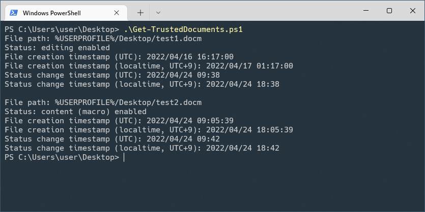

# PS-TrustedDocuments: PowerShell script to handle information on trusted documents for Microsoft Office



[Trusted documents](https://support.microsoft.com/en-us/office/trusted-documents-cf872bd8-47ec-4c02-baa5-1fdba1a11b53) are Microsoft Office document files that have been marked as trusted by enabling active content (such as macro) in them. A document file is marked as trusted when a user clicks the "Enable Editing" button or the "Enable Content" button in the following message bars.


Information on trusted documents is stored in the Windows registry and it contains these properties:
- File path
- Status (editing enabled or content (macro) enabled)
- File creation timestamp
- Status change timestamp (the last edit or execution of the macro)
- Timezone offset

Information on trusted documents is useful for incident response relating to malicious Microsoft Office documents by checking when and in which Microsoft Office document file a malicious macro was executed. So I created Get-TrustedDocuments.ps1 that is a PowerShell script to display information on trusted documents. I would create other PowerShell scripts to modify or remove information on trusted documents in the future.

<!-- [Get-TrustedDocuments.ps1](https://github.com/nmantani/PS-TrustedDocuments#get-trusteddocumentsps1) -->

How to use this script is described as follows. You can also use `Get-Help` cmdlet to see the same information.

## Get-TrustedDocuments.ps1
This script retrieves information on trusted documents for Microsoft Office stored under the `HKEY_CURRENT_USER\SOFTWARE\Microsoft\Office\[version]\[document type]\Security\Trusted Documents` registry keys. This script displays the status of trusted documents (editing enabled or content (macro) enabled), file creation timestamp, and status change timestamp (the last edit or execution of the macro, the time resolution of the status change timestamp is minutes).

### Usage
```powershell
PS> powershell -ExecutionPolicy Bypass Get-TrustedDocuments.ps1
[[-DocumentType] <String>] [-EditingEnabledOnly] [-ContentEnabledOnly]
[[-User] <String>] [[-HiveFilePath] <String>] [<CommonParameters>]
```

### Parameters (all of them are optional)
- DocumentType  
Specifies the document type such as Word, Excel, and PowerPoint. Only information on the specified document type will be displayed. This parameter is case insensitive.

- EditingEnabledOnly  
If this parameter is specified, this script will display only information on documents that editing is enabled.

- ContentEnabledOnly  
If this parameter is specified, this script will display only information on documents that content (macro) is enabled.

- User  
Specifies the user. If both this parameter and HiveFilePath are not specified, this script will display information for the current user. Administrator privilege is required to use this parameter to display information for another user.

- HiveFilePath  
Specifies the path of an offline registry hive file (NTUSER.DAT file extracted from another computer) to display information. If this parameter is not specified, this script uses the HKEY_CURRENT_USER registry hive of the current user. Administrator privilege is required to use this parameter because this script temporarily loads the offline registry hive file into the "HKEY_USERS\PS-TrustedDocuments" registry key.

### Examples
```powershell
# Displaying information on all trusted documents for the current user.

PS> powershell -ExecutionPolicy Bypass .\Get-TrustedDocuments.ps1
```

```powershell
# Displaying information on trusted Word documents for the current user.

PS> powershell -ExecutionPolicy Bypass .\Get-TrustedDocuments.ps1 -DocumentType word
```

```powershell
# Displaying information on trusted documents that editing is enabled.

PS> powershell -ExecutionPolicy Bypass .\Get-TrustedDocuments.ps1 -EditingEnabledOnly
```

```powershell
# Displaying information on trusted documents that content (macro) is enabled.

PS> powershell -ExecutionPolicy Bypass .\Get-TrustedDocuments.ps1 -ContentEnabledOnly
```

```powershell
# Displaying information on trusted documents for the specified user.
# Administrator privilege is required to display information for another user.

PS> powershell -ExecutionPolicy Bypass .\Get-TrustedDocuments.ps1 -User exampleuser
```

```powershell
# Displaying information on trusted documents from an offline registry hive file.
# Administrator privilege is required.

PS> powershell -ExecutionPolicy Bypass .\Get-TrustedDocuments.ps1 -HiveFilePath .\extracted\NTUSER.DAT
```

## Acknowledgment
I got great insight of undocumented data structure and timestamp calculation of trusted documents from the code of [OfficeForensicTools](https://github.com/DissectMalware/OfficeForensicTools) and [tweets](https://twitter.com/DissectMalware/status/1242399401156452353) by Malwrologist ([@DissectMalware](https://twitter.com/DissectMalware)) . Thank you so much!

## References
- [Trusted documents](https://support.microsoft.com/en-us/office/trusted-documents-cf872bd8-47ec-4c02-baa5-1fdba1a11b53) (Microsoft)
- [OfficeForensicTools](https://github.com/DissectMalware/OfficeForensicTools) by Malwrologist ([@DissectMalware](https://twitter.com/DissectMalware))
- [A Twitter thread explaining undocumented data structure and timestamp calculation of trusted documents](https://twitter.com/DissectMalware/status/1242399401156452353) by Malwrologist ([@DissectMalware](https://twitter.com/DissectMalware))
- [More on Trust Records, Macros and Security, Oh My!](http://az4n6.blogspot.com/2016/02/more-on-trust-records-macros-and.html) by Mari DeGrazia ([@maridegrazia](https://twitter.com/maridegrazia))
- [MS Office File Format Sorcery](https://troopers.de/downloads/troopers19/TROOPERS19_AR_MS_Office_file_format_sorcery.pdf) by Pieter Ceelen & Stan Hegt

## Author
Nobutaka Mantani (Twitter: @nmantani)

## License
The BSD 2-Clause License (http://opensource.org/licenses/bsd-license.php)
